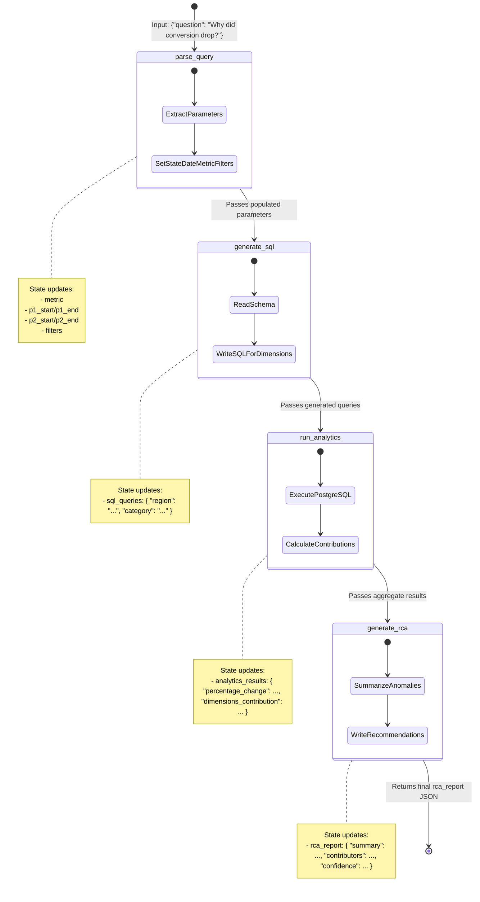

# LangGraph Deep Dive - Learning Module

This document outlines the LangGraph concepts utilized in Phase 3 of the **AI SQL Root Cause Investigator** project, including a comparison with LangChain, state transition flows, and node-by-node architecture.

---

## 1. LangGraph vs. LangChain: Structural Comparison

A common point of confusion is how LangGraph relates to the core LangChain library.

| Feature | LangChain (Chains / LCEL) | LangGraph |
| :--- | :--- | :--- |
| **Execution Model** | Directed Acyclic Graph (DAG) / Linear Chain | Cyclic Directed Graph (State Machine) |
| **Core Abstraction** | Runnable Sequence (Input -> Prompt -> LLM -> Output) | State + Nodes + Edges |
| **State Management** | None (Values pass through the chain sequentially) | Centralized, persistent `AgentState` object |
| **Looping / Cycles** | No (Cannot loop back to previous steps natively) | Yes (Can route back to previous nodes in cycles) |
| **Ideal Use Case** | Single-shot pipelines, translation, simple retrieval | Multi-step workflows, agent networks, self-correcting loops |

### Why we chose LangGraph over LangChain:
While a simple LangChain pipeline can send a question to an LLM and return a query, it lacks the structure to coordinate multiple specialized agents (parsing -> SQL generation -> execution -> reporting) while sharing a centralized, mutable state. LangGraph enforces a strict state machine that guarantees our nodes run in order, handle errors cleanly, and share database parameters securely.

---

## 2. LangGraph Workflow & State Transitions

Our Root Cause Investigator is implemented as a State Machine. Here is the visual flow of the state changes:

### How the State Transitions:
1. The client invokes the graph with `{ "question": "Why did conversion drop in February?" }`.
2. **`parse_query`** runs, updates the state with the extracted dates and metric, and passes it forward.
3. **`generate_sql`** runs, updates the state with the generated SQL queries, and passes it forward.
4. **`run_analytics`** executes these SQL queries on PostgreSQL, computes period changes and mathematical contributions, updates `analytics_results`, and passes it forward.
5. **`generate_rca`** reviews the calculations, writes the final report containing the summary, contributors list, confidence score, and recommendations, and saves it to `rca_report`.
6. The compiled graph finishes execution and returns the populated `rca_report` back to FastAPI.

---

## 3. Node-by-Node Architecture: Why Each Node Exists

Every node in our graph has a strict single responsibility. Here is why each exists and what it does:

### Node 1: `parse_query` (Query Understanding Agent)
* **Why it exists**: Natural language questions are messy and contain vague references (e.g. "last month", "April", "Bangalore"). Computers need precise date ranges and database column filters to execute queries.
* **Input**: `question` (raw string).
* **Output**: `metric`, `p1_start`, `p1_end`, `p2_start`, `p2_end`, `filters`.
* **Under the Hood**: Uses an LLM with Pydantic structured output validation to map dates relative to the current date reference (June 2026).

### Node 2: `generate_sql` (SQL Agent)
* **Why it exists**: We want a system that dynamically adapts to queries on different dimensions (e.g. region, category, customer segment) without hardcoding queries for every possible combination. The SQL Agent translates our filters and groupings into optimized PostgreSQL statements.
* **Input**: `metric`, `filters`.
* **Output**: `sql_queries` (a map of dimensions to generated SQL statements).
* **Under the Hood**: Provided with the active database table schemas, writes safe read-only SQL queries containing parameters.

### Node 3: `run_analytics` (Analytics Agent)
* **Why it exists**: LLMs are notoriously bad at math. We cannot trust an LLM to look at database outputs and sum numbers, subtract baselines, and compute percentages accurately. This node exists to run standard Python mathematical algorithms over the database outputs.
* **Input**: `sql_queries`, `p1_start/p1_end`, `p2_start/p2_end`, `filters`.
* **Output**: `analytics_results` (MoM growth rates, absolute differences, and percentage contributions).
* **Under the Hood**: Connects to the database connection pool, runs the parameterized SQL queries, and applies the contribution formula to calculate negative and positive business impact.

### Node 4: `generate_rca` (RCA Agent)
* **Why it exists**: Raw mathematical matrices (e.g. `{"region": "South", "contribution": -13.63}`) are hard for business managers to read. We need an LLM to synthesize this data into a professional executive summary and actionable recommendations.
* **Input**: `analytics_results`, `metric`.
* **Output**: `rca_report` (containing `summary`, `contributors`, `confidence`, `recommendations`).
* **Under the Hood**: An LLM reads the calculated values and translates them into a cohesive explanation, assigning a data-driven confidence score.

---

## 4. Key Interview Questions

1. *What is the purpose of the `TypedDict` state in LangGraph, and how does LangGraph handle concurrent node updates?*
2. *How would you implement a self-correcting SQL loop in LangGraph? (Explain how a node could catch a SQL syntax error, pass the error back to the SQL node, and repeat the loop).*
3. *What are the latency implications of serial multi-agent loops in LangGraph, and how do you optimize them? (e.g., executing SQL generation nodes in parallel).*
4. *How does LangGraph maintain state across user sessions? (Explain the role of checkpoints and memory threads).*
